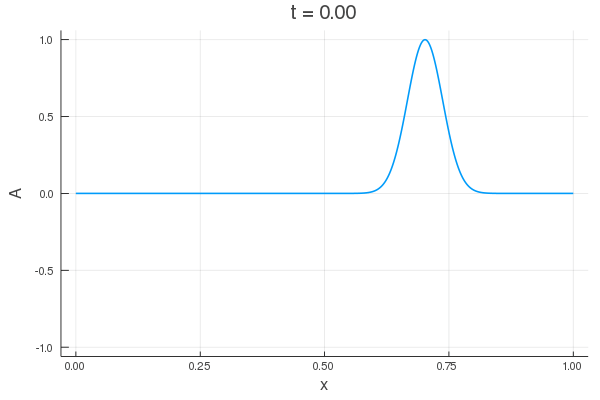

# Solving the Wave Equation
This package is designed to solve the 1D wave equation:

Example output:

## Assignment
Create a Julia package that solves the scalar wave equation in 1+1 dimensions. You will need to:

- choose a domain (e.g. the unit interval [0, 1])
- choose a suitable discretization method (e.g. piecewise linear continuous functions) for this domain
- choose a formulation of the wave equation, i.e. a concrete set of evolved variable ("state vector") and evolution equations for these
- define a suitable (conserved) energy
- choose suitable initial and boundary conditions
- implement this in Julia
- compare solutions at different resolutions and demonstrate convergence
- create a figure(s) so that others can understand your work
- present all the above in a git repository

## Method
The wave equation is solved on a domain of [0,1] using simple position-based discretization (piecewise linear continuous functions). An initial configuration and a first time derivative for the wavefunction *A* are specified and then these states are evolved with a 2nd order Runge-Kutta integration scheme.

In general, this kind of integration technique works for differential equations which can be expressed in the form

)

Where *w* is a state vector entirely describing the current state of the system. The time evolution of the state is then given by:

%20\Delta%20t}{2}%20\right)\Delta%20t)

For the wave equation, it can be represented in this state formalism as:

## Using this code
The notebook `src/demo.ipynb` contains a demonstration of using solving the wave equation using the functions defined in `src/WaveEquation.jl`. It also shows that total energy is conserved.

The notebook `src/convergence.ipynb` demonstrates the convergence of a solution for increasing resolution in both time and space.
